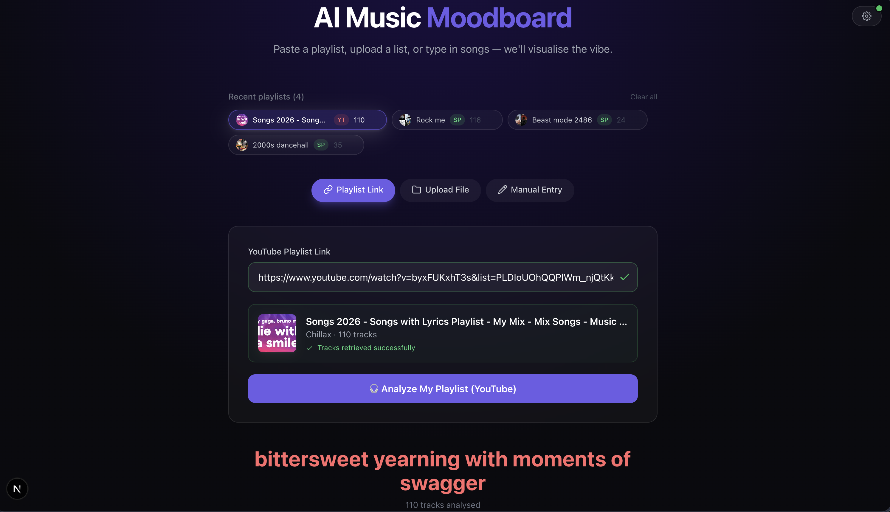
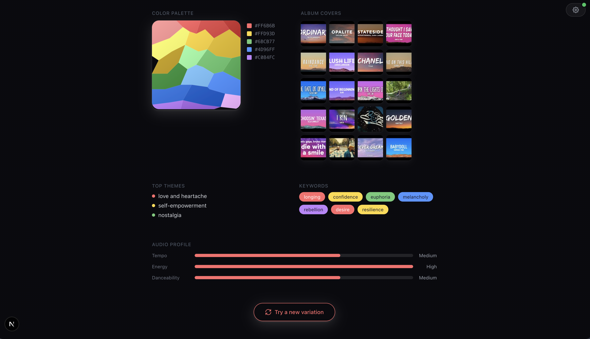

# 🎨 AI Music Moodboard

> Paste a Spotify or YouTube playlist, upload a song list, or type in songs — we'll visualise the vibe.

AI Music Moodboard analyses your playlist using AI and generates a visual moodboard with colour palettes, album art collages, themes, keywords, and audio profile meters.





---

## 🚀 How It Works

1. **Choose an input method** — paste a Spotify or YouTube playlist link, upload a CSV/text file, or type songs manually.
2. **Preview validation** — for links, the app fetches playlist metadata and verifies tracks are accessible before you hit analyse.
3. **AI mood analysis** — track names and artists are sent to [DeepSeek AI](https://deepseek.com), which returns a mood summary, colour palette, themes, keywords, and audio profile.
4. **Visual moodboard** — results are rendered as an interactive moodboard with a shattered-glass colour cube, album art collage, theme list, keyword pills, and audio profile meters.
5. **Try a new variation** — re-run the analysis on the same playlist for a different AI interpretation.

---

## 🔑 API Keys

You need three API keys (set them in **Settings** → gear icon, or in `.env.local`):

| Key | Purpose |
|---|---|
| **Spotify** Client ID + Secret + Refresh Token | Fetch playlist metadata and tracks |
| **YouTube** Data API v3 key | Fetch YouTube playlist metadata and video titles |
| **DeepSeek** API key | AI mood/palette/themes analysis |

All credentials are stored **only in your browser's localStorage** and sent directly to the respective APIs — no data passes through any server.

---

## 🛠 Tech Stack

- **Next.js 15** (App Router, standalone output for Docker)
- **React 19** with TypeScript
- **Tailwind CSS 3.4** with custom brand colours
- **Spotify Web API** (Refresh Token flow)
- **YouTube Data API v3**
- **DeepSeek Chat API** (OpenAI-compatible)
- **Docker** + docker-compose for development

---

## 🏃 Running Locally

```bash
# 1. Clone the repo
git clone https://github.com/muganwas/music_mood_visualiser.git
cd music_mood_visualiser

# 2. Install dependencies
npm install

# 3. Set up environment variables
cp .env.local.example .env.local
# Edit .env.local with your API keys (or use the in-app Settings page)

# 4. Run the dev server
npm run dev
# → http://localhost:3000

# Or with Docker
docker compose up --build
```

---

## 📁 Project Structure

```
├── app/
│   ├── api/
│   │   ├── analyze/          # AI mood analysis endpoint
│   │   ├── spotify/          # Spotify playlist preview & tracks
│   │   ├── youtube/          # YouTube playlist preview & tracks
│   │   └── auth/             # Spotify OAuth helpers
│   ├── settings/             # Credentials management page
│   ├── page.tsx              # Home page (input + results)
│   ├── layout.tsx            # Root layout
│   └── globals.css           # Global styles & shadow utilities
├── components/
│   ├── PlaylistInput.tsx     # Link input with Spotify/YouTube auto-detection
│   ├── FileUpload.tsx        # CSV/text file upload
│   ├── SongList.tsx          # Manual song entry
│   ├── MoodboardResult.tsx   # Full moodboard visualisation
│   ├── PaletteVisual.tsx     # Shattered-glass colour cube SVG
│   ├── NavBar.tsx            # Settings navigation
│   ├── icons.tsx             # Flat SVG icon components
│   └── profile/
│       ├── ProfilePanel.tsx  # Credential input form
│       └── PlaylistHistory.tsx # Recent playlists chips
├── lib/
│   ├── spotify.ts            # Spotify API helpers
│   ├── youtube.ts            # YouTube API helpers
│   ├── deepseek.ts           # DeepSeek AI prompt & API call
│   └── stores/               # React Context (credentials, playlists)
└── public/                   # Static assets
```

---

## 📄 License

MIT
